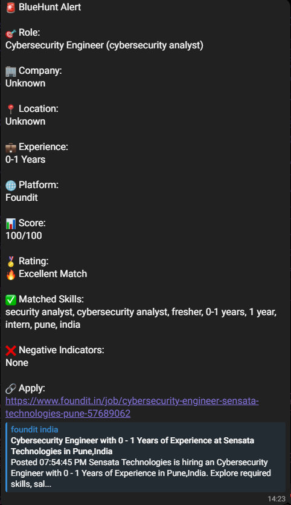
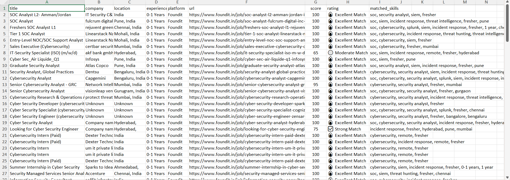
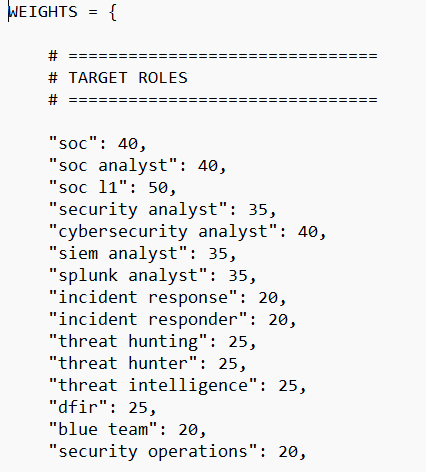
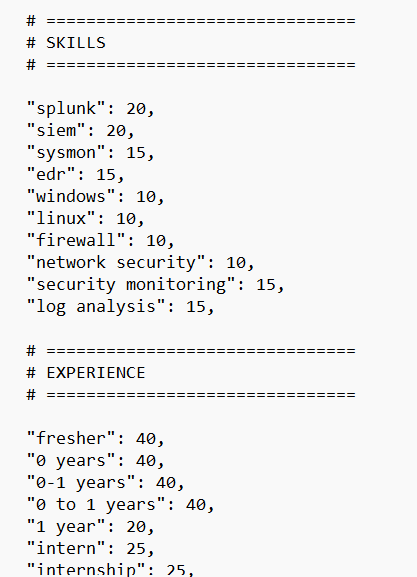
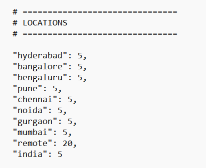
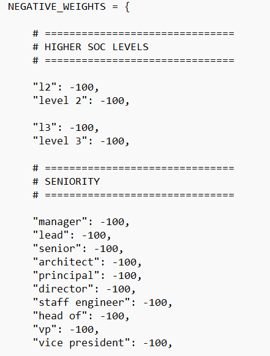
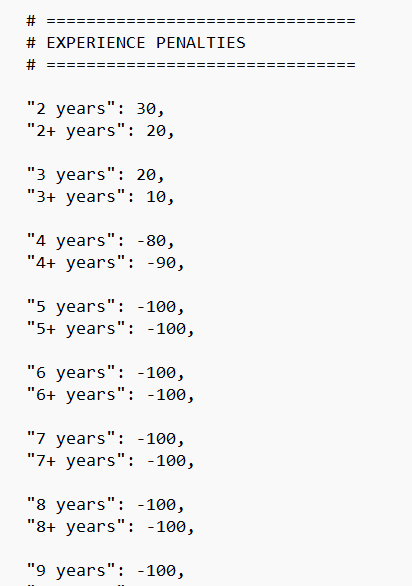
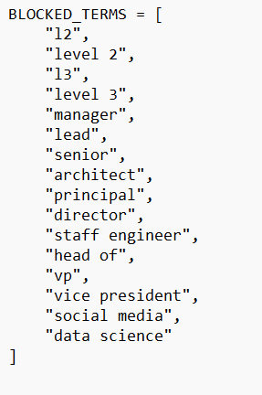

# 🚀 BlueHunt


## Automated Cybersecurity Job Acquisition Pipeline

## 📌 Problem Statement
As a cybersecurity fresher, I experienced the challenge of identifying relevant opportunities despite having the required technical skills.
Cybersecurity jobs are distributed across multiple platforms, and manually searching, filtering, and tracking suitable opportunities consumes a significant amount of time every day.
To solve this problem, I built **BlueHunt**, an automated cybersecurity job acquisition pipeline that aggregates job postings from multiple platforms and filters them based on cybersecurity skills, experience requirements, role seniority, and location preferences.
Although BlueHunt currently supports a small number of carefully selected sources, these platforms collectively cover the majority of entry-level cybersecurity opportunities relevant to my target roles.

Challenges include:

- Duplicate job postings across multiple platforms.
- Large numbers of irrelevant or senior-level positions.
- Missing newly posted opportunities.
- Manual tracking of applied jobs.
- Time wasted switching between multiple job platforms.

BlueHunt automates this entire process.
## Workflow

1. Fetch jobs from supported platforms.
2. Extract structured job information.
3. Filter irrelevant and senior-level roles.
4. Score jobs based on skill relevance.
5. Remove duplicate entries.
6. Store unique jobs in Excel.
7. Send Telegram notifications for high-quality matches.
8. 
## ⚡Features
- ✅ Multi-platform cybersecurity job scraping
- ✅ SOC and Cybersecurity focused scoring engine
- ✅ Fresher-friendly job prioritization
- ✅ Senior role filtering
- ✅ Environment variable based secret management
- ✅ Duplicate job detection
- ✅ Telegram notifications for strong matches
- ✅ Persistent job database using Excel
- ✅ Automated scheduling using Windows Task Scheduler
- ✅ Experience-aware ranking engine
- ✅ Location-aware filtering for Indian cybersecurity roles
- 
## 🌐 Supported Platforms
Currently supported:

- LinkedIn
- Naukri
- Foundit
- Internshala

---

# 🏗 Architecture

```text
 LinkedIn      Foundit      Naukri      Internshala
      \           |           |            /
       \          |           |           /
        +------------------------------+
        |      Job Fetchers            |
        +------------------------------+
                     |
                     ▼
        +------------------------------+
        |     Filtering Engine         |
        +------------------------------+
                     |
                     ▼
        +------------------------------+
        |      Scoring Engine          |
        +------------------------------+
                     |
                     ▼
        +------------------------------+
        |   Duplicate Detection        |
        +------------------------------+
                     |
             +-------+-------+
             |               |
             ▼               ▼
      Excel Database   Telegram Alerts
```
---

# 🛠 Tech Stack

| Category | Technologies |
|----------|-------------|
| Language | Python |
| Browser Automation | Playwright |
| Data Processing | Pandas |
| Storage | OpenPyXL |
| Notifications | Telegram Bot API |
| Scheduling | Windows Task Scheduler |
| Environment Management | python-dotenv |
| Version Control | Git, GitHub |

---
# ⚙ Installation

## Clone Repository

```bash
git clone https://github.com/jashuboy/BlueHunt.git
cd BlueHunt
```

## Install Dependencies

```bash
pip install -r requirements.txt
```

## Install Playwright Browsers

```bash
playwright install
```

## Configure Environment Variables

Create a `.env` file:

```env
BOT_TOKEN=YOUR_TELEGRAM_BOT_TOKEN
CHAT_ID=YOUR_TELEGRAM_CHAT_ID
```

---

# ▶ Usage

Run manually:

```bash
python main.py
```

Or configure:

```text
Windows Task Scheduler
```

to automate scans at scheduled intervals.

---
# 📷 Assets
# Telegram Alert

# Job Database

# Target Roles

# Skills and Experience

# Locations

# Negative Weights

# Experience Penalties

# Blocked Terms


---

# 📂 Project Structure

```text
BlueHunt/
│
├── core/
│   ├── filtering.py
│   ├── scoring.py
│   ├── storage.py
│   └── telegram_bot.py
│
├── fetchers/
│   ├── foundit.py
│   ├── linkedin.py
│   ├── naukri.py
│   └── internshala.py
│
├── data/
│
├── config.py
├── main.py
├── requirements.txt
├── run_bluehunt.bat
└── README.md
```

---

# 🔮 Future Improvements

- AI-powered Resume Match Engine
- Company whitelist and blacklist
- Daily job digest notifications
- Application tracking dashboard
- AI-based resume tailoring
- AI-powered resume match scoring
- Interview preparation recommendations

---

# 👨‍💻 Author

**Jashwanth Dola**

- LinkedIn: https://www.linkedin.com/in/jashwanthdola/
- GitHub: https://github.com/jashuboy

---

# ⭐ Support

If you found this project useful, consider giving it a star.
